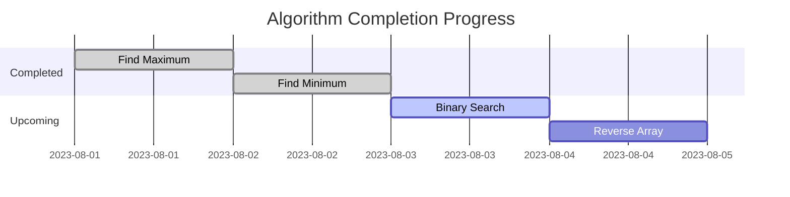

```markdown
# 📚 Daily Algorithms Challenge


A curated collection of algorithms implemented in C++, one per day. Each solution comes with detailed explanations, complexity analysis, and test cases.

## 🚀 Project Structure

```
daily-algorithms/
├── Day-01-FindMax/
│   ├── findMax.cpp
│   └── README.md
├── Day-02-FindMin/
│   ├── find_min.cpp
│   └── README.md
└── ... (future days)
```

## 🌟 Featured Algorithms

### 🔢 Basic Operations
| Day | Algorithm | Complexity | Category |
|-----|-----------|------------|----------|
| 1 | [Find Maximum](Day-01-FindMax/) | O(n) | Array |
| 2 | [Find Minimum](Day-02-FindMin/) | O(n) | Array |
| 3 | Binary Search | O(log n) | Search |
| 4 | Reverse Array | O(n) | Array |

*(Table will auto-expand as you add more algorithms)*

## 🛠️ Development Setup

1. **Clone the repository**:
   ```bash
   git clone https://github.com/your-username/daily-algorithms.git
   cd daily-algorithms
   ```

2. **Compile any algorithm**:
   ```bash
   g++ Day-XX-AlgorithmName/source.cpp -o output
   ```

3. **Run the executable**:
   ```bash
   ./output
   ```

## 📊 Progress Tracker



## 🤝 Contribution Guidelines

1. Fork the repository
2. Create a new branch for your algorithm:
   ```bash
   git checkout -b day-N-algorithm-name
   ```
3. Add your implementation in a new folder:
   ```
   Day-N-AlgorithmName/
   ├── algorithm.cpp
   ├── README.md
   └── tests.txt
   ```
4. Submit a pull request

## 📚 Learning Resources

- [Big-O Cheat Sheet](https://www.bigocheatsheet.com)
- [CPP Reference](https://en.cppreference.com)
- [Visual Algorithm Explorer](https://visualgo.net)

## 🏆 Badges

Earn badges by completing challenges:

 


## ✨ Features

- **Daily Challenges**: Bite-sized algorithm problems
- **Detailed Explanations**: Theory and implementation notes
- **Test Cases**: Ready-to-use verification samples
- **Progress Tracking**: Visual completion metrics

---

<div align="center">
  <sub>Maintained with ❤ by <a href="https://github.com/your-username">JDorie963</a></sub> |
  <a href="https://github.com/your-username/daily-algorithms/issues">Report Issue</a> |
  <a href="https://github.com/your-username/daily-algorithms/discussions">Discuss Ideas</a>
</div>
```
